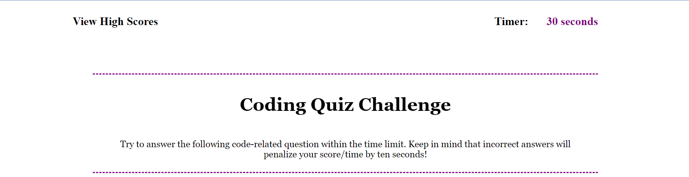

# code-quiz-challenge

#This file includes a three question assessment on web development.

#As the user you start the test by clicking on the Start Quiz button.

#You have ten seconds to answer each question and 30 seconds in all.

## Installation

- Clone my repo and open the html file in a browser.

